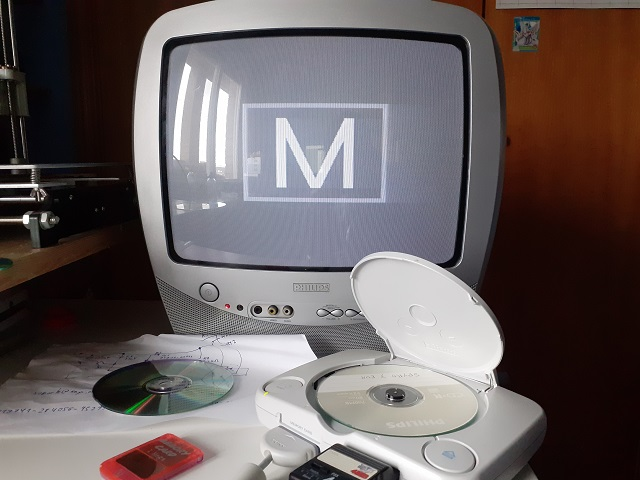
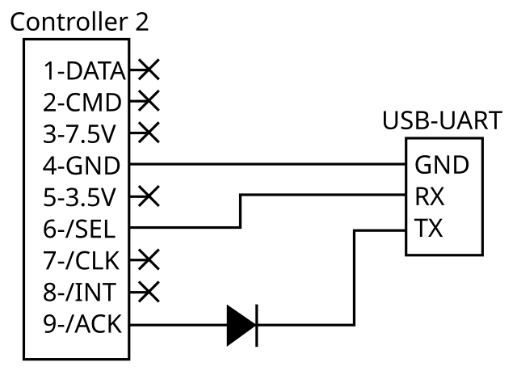

joymon
======

Software-only serial monitor for the PlayStation 1, for reading, writing and executing arbitrary
memory locations.

Instead of relying on the physical serial port present in fat PS1 consoles, this tool uses the
controller port's /SEL and /ACK pins to emulate an UART in software, allowing it to be used in
fat PS1 and slim PSone consoles (and possibly PS2 as well).

The diode should be a fast Schottky diode like a 1N4148, as it might not work with a regular
rectifier like the 1N4007 due to slower recovery and higher forward drop.
